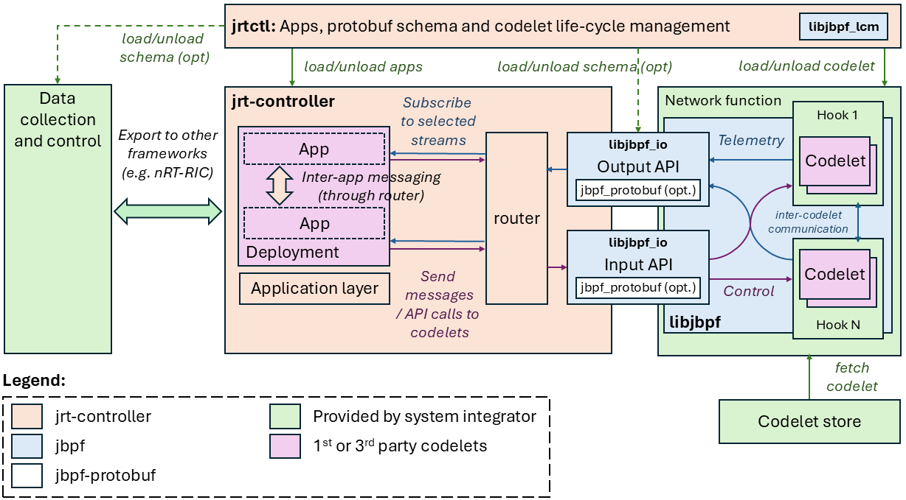

# Introduction
[](https://belgrade.visualstudio.com/jrt-controller/_build/latest?definitionId=148&repoName=microsoft%2Fjrt-controller&branchName=main)

*jrt-controller* is a real-time controller for network functions instrumented with the [jbpf framework](https://github.com/microsoft/jbpf).
Like jbpf, the controller is part of [Project Janus](https://www.microsoft.com/en-us/research/project/programmable-ran-platform/) and provides functionalities envisaged by the concept of real-time RIC in O-RAN. 


# Architectural overview

The overall *jrt-controller* architecture is shown in the figure below:



A typical deployment consists of the following components:
* **Network function**: An external, user-provided executable (e.g. virtualized RAN or any other network function) which we want to monitor and control and which has been instrumented using the jbpf framework.
* **jbpf library**: An [external library](https://github.com/microsoft/jbpf) that provides the functionality of deploying and executing codeletes, sending output data (output API) and receiving control data (input API). 
* **jrt-controller**: The main component of this repository that runs user-provided applications (dApps in the O-RAN terminology), which consume telemetry data from the network functions and invoke control actions, all with latencies of a few microseconds.
* **jrt-ctl**: This is a collection of tools to load/unload user applications and codelets (*codelet life-cycle management* and *secure codelet store*). It can be optionally integrated with other management frameworks (e.g. nRT-RIC or SMO in O-RAN terminology).

The *jrt-controller* can connect to any network function already instrumented with the jbpf framework without any changes. 

For a high-level overview of the framework functionality, please read [this](./docs/overview.md). 


# Getting started

## Instructions to build the controller

The first step is to initialize all git submodules:
```sh
./init_submodules.sh
```

### Building on bare metal

A list of all the dependencies required for bare metal builds are listed in the Dockerfiles located [here](./deploy/) for several common Linux distributions.

To build you can use the following commands:

```sh
# source environment variables
source ./setup_jrtc_env.sh

mkdir build
cd build
cmake ../ && make
```


## Doxygen documentation
You can generate the documentation using Doxygen. To do so, run the following:
```
make doc
```

The documentation will be generated in the `$JRTC_OUT_DIR/docs/html` directory, where `$JRTC_OUT_DIR` is automatically set when sourcing `setup_jrtc_env.sh`.

# Further documentation

For more details about the capabilities of *jrt-controller* you can explore the documentation:

* [High-level overview ](./docs/overview.md)
* [Simple example](./docs/understand_simple_app.md)
* [Simple example - using JrtcApp abstraction class with C interface](./docs/understand_simple_app_c.md)
* [Simple example - using JrtcApp abstraction class with Python interface](./docs/understand_simple_app_py.md)
* [Advanced example](./docs/understand_advanced_app.md)
* [Advanced example -using JrtcApp abstraction class with C interface](./docs/understand_advanced_app_c.md)
* [Streams and messages](./docs/streams.md)
* [Building with containers](./docs/containers.md)
* [jrtc-ctl management tool](./docs/jrtctl.md)


For more information, you can also check the following resources:
- [jbpf technical paper](https://www.microsoft.com/en-us/research/publication/taking-5g-ran-analytics-and-control-to-a-new-level/): A technical research paper that describes the motivation behind the framework. The paper is focused on 5G RAN instrumentation, but most concepts extend to arbitrary applications. 
- [Distributed AI for RAN technical paper](https://www.microsoft.com/en-us/research/uploads/prod/2024/10/Distributed-AI-for-RAN-TR.pdf): A research paper that describes a blueprint for an AI-native RAN platform, and which could be realized using the jrt-controller and jbpf.

# Related projects

- [jbpf](https://github.com/microsoft/jbpf): the userspace eBPF instrumentation and control framework used to instrument network functions that communicate with *jrt-controller*. 
- [jbpf-protobuf](https://github.com/microsoft/jbpf-protobuf): An extension of jbpf, that introduces protobuf serialization capabilities for sending and receiving data from codelets loaded in jbpf applications.

# License

The jbpf framework is licensed under the [MIT license](LICENSE.md).

