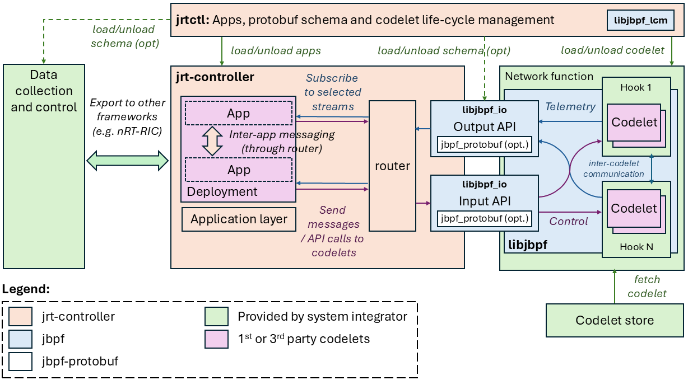

# High-level overview

The *jrt-controller* is a controller that allows the deployment of real-time applications that can monitor and control a set of underlying network functions.
In the context of 5G Radio Access Networks, it realizes the capabilities envisaged by the O-RAN real-time RIC and dApps. 

In contrast to jbpf codelets, which are inlined in the execution path of the network functions and can be used for monitoring and control operations at sub-μs granularities, *jrt-controller* applications can be used to implement more sophisticated real-time logic in the order microsecods or milliseconds. 
By combining the capabilities of jbpf with this type of look-aside monitoring and control, one can implement very powerful and expressive real-time applications.

A typical operation of the *jrt-controller* is to fetch telemetry data from the network function using [jbpf](https://github.com/microsoft/jbpf) probes and to expose them to the applications. 
The data is shared over a shared-memory interface utilizing a zero-copy mechanism, making the data transport extremely fast. 
It also allows applications to send messages back to *jbpf* probes and excert control over the network functions. 

Central to the *jrt-controller* is the notion of a stream or a channel. 
A stream can be created by a *jbpf* codelet or by a *jrt-controller* application. 
An application can subscribe to receive data from stream or multiple streams and can also emit data to one or more streams towards other applications or codelets. 
Optionally, one can associate a stream with a data *schema* to facilitate automatic serialization/deserialization when communicating over the network to *Data collection and control* end-points. 
For more information on streams see [here](./streams.md).

A developer creates a *deployment*, which consists of one or more applications, one or more codelets, and if required one of more schemas. 
Different componets of a deployment can share streams. 
The life cycle management of deployments is done through the **jrtc-ctl** tool, which provides a control interface for loading/unloading deployments (applications, *jbpf* codelets and schemas, if needed).
For further details, see [here](./jrtctl.md).

The *jrt-controller* is currently composed of two main layers:
* **Application layer** -- This is an execution environment that runs applications. At the moment, an application is packaged as a dynamically linked library (an `.so` file). Moreover, python-based applications are also supported, when low-latency is not a hard requirement. In the future we are also planning on implementing a safer, Web Assembly based execution environment, that will allow the development of applications in any language desired by the developer. 
* **Stream router** -- This is a component that sits at the core of *jrt-controller* and manages the messages and data passed among applications and codelets through the various streams. The stream-communication is realized in the form of a pub-sub system.

In addition to the internal components of the *jrt-controller*, there are also two additional external components that must be provided by the user (e.g. a system integrator):
* **Network function** is the component (e.g. RAN) that we want to instrument and control. It is instrumented with the [*jbpf* library](https://github.com/microsoft/jbpf). 
* **Data collection and control** is an optional component that *jrt-controller* communicates and exchanges data with. One such example is a nRT-RIC or an SMO in the O-RAN terminology. For more details, see [here](./streams.md).

